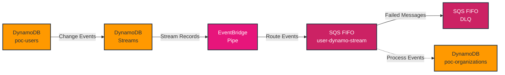

# poc-dynamostreams

A proof of concept demonstrating DynamoDB Streams for cross-table data replication. This project showcases how to maintain consistent organization membership records across tables using DynamoDB Streams, EventBridge Pipes, SQS, and Lambda.

## Architecture

The project implements a serverless event-driven architecture for maintaining consistency between user and organization data:

### Core Components

1. **DynamoDB Tables**
   - `poc-users`: Stores user data with DynamoDB Streams enabled
   - `poc-organizations`: Stores organization data
   - Both tables use a composite key (pk + sk) structure

2. **Event Processing Pipeline**
   - DynamoDB Streams capture changes to the user table
   - EventBridge Pipe routes stream events to SQS
   - FIFO SQS queues ensure ordered processing:
     - Main Queue: `user-dynamo-stream.fifo`
     - Dead Letter Queue: `user-dynamo-stream-deadletter.fifo`

3. **Error Handling**
   - Dead Letter Queue for failed message processing
   - Maximum retry count: 5 attempts
   - Content-based deduplication enabled

### Data Flow

1. Changes to user records in the `poc-users` table trigger DynamoDB Streams
2. Stream events (containing both old and new images) are captured
3. EventBridge Pipe routes these events to the FIFO SQS queue
4. Failed messages are automatically moved to DLQ after 5 retries

### Security

- IAM roles with least privilege access
- Service-to-service authentication using AWS IAM
- Resource-based policies for EventBridge Pipes

## Available Commands

This project uses [Taskfile](https://taskfile.dev/) for task automation. Here are the available commands:

### Deployment Commands

- `task deploy` - Build and deploy the full stack
  - Runs SAM build, validation, deployment, and cleanup

- `task delete` - Delete the full stack
  - Removes S3 buckets and deletes the stack

### SAM Commands

- `task sam-build` - Build the SAM application
- `task sam-validate` - Validate the SAM template with linting
- `task sam-deploy` - Deploy the SAM application
- `task sam-delete` - Delete the SAM application (no prompts)

### DynamoDB Operations

- `task put-item` - Add a user record to DynamoDB
  - Adds a user to the `poc-users` table with sample metadata
  - Default user has ACTIVE status and organization memberships

- `task delete-item` - Delete a specific item from DynamoDB
  - Removes an item from the `poc-users` table
  - Requires PK and SK values

### User Management

- `task user:delete` - Delete a user record
  - Requires USER_ID environment variable

### Maintenance

- `task cleanup` - Perform cleanup operations after deployment or deletion
